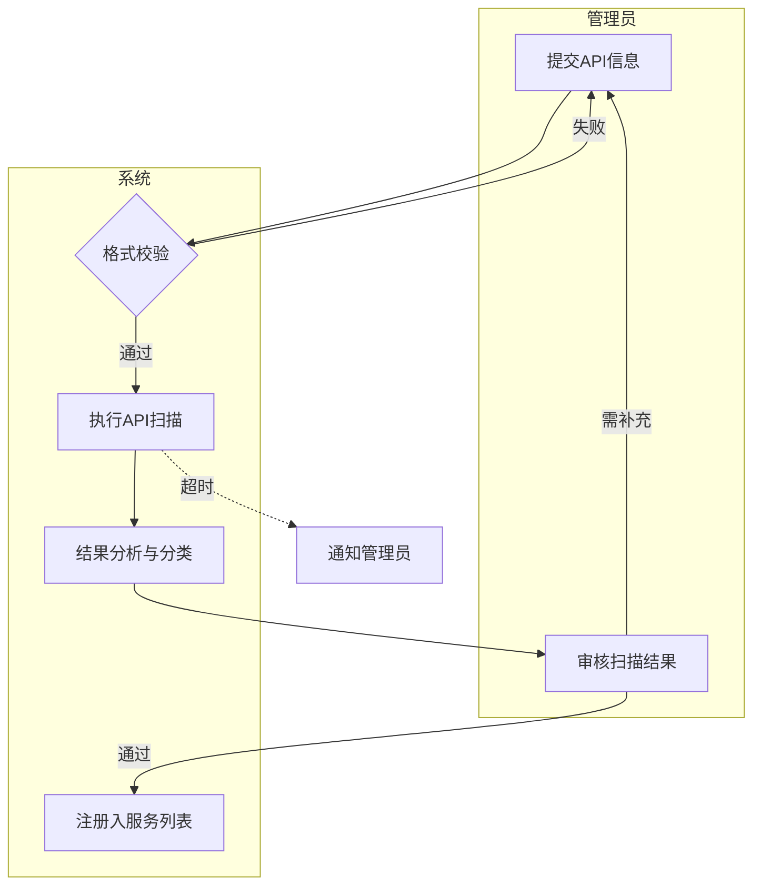

# ce-brainstorm 证据链补全设计规划

> **状态**：v0.4 — 综合第四轮反馈修订  
> **日期**：2026-08-05  
> **来源**：3 条 P1 workflow-feedback（20260803-161500/01/02-sop-flow）  
> **影响范围**：`skills/ce-brainstorm/`（SKILL.md + references）+ 产物目录结构

---

## 一、背景与根因

### 1.1 三份 Feedback 统一根因

| ID | 问题 | 证据链断点 |
|----|------|-----------|
| FB1 | 需求沟通过程未保存原始记录 | 对话 → PRD（中间无留痕） |
| FB2 | 缺少业务场景分析阶段 | 对话 → [缺失] → 功能清单 |
| FB3 | PRD 业务流程基本不对 | 对话 → [缺失] → 业务流程 → 功能清单 |

**根因**：Phase 1.3（对话）直接进入 Phase 2（方案探索），缺少从对话到结构化业务知识的 **分析转化** 和 **用户确认** 环节。

### 1.2 目标证据链

```
Phase 1.3 对话
  ↓
Phase 1.4 对话日志持久化 → requirement/vN/dialogue-log.md
  ↓
Phase 1.5 业务场景分析 → QA-1 场景质量检查 → 用户确认 ✅
  ↓
Phase 1.6 业务流程分析 → QA-2 流程质量检查 → 用户确认 ✅
  ↓
Phase 2 方案探索 → Phase 2.5 综合 → QA-3 综合质量检查 → 用户确认
  ↓
Phase 3 PRD 生成 → QA-4 PRD 质量检查
  ↓
Phase 3.6 PRD ↔ 场景/流程双向验证（准出门禁）
  ↓
版本归档 → ledger.md 批量写入 → 进入开发
```

---

## 二、状态管理（简化方案）

### 2.1 ce-brainstorm 内状态

ce-brainstorm 只关注需求的 **探索与确认**，不管控下游生命周期。条目仅两种状态：

| 状态 | 图标 | 含义 | 触发时机 |
|------|------|------|---------|
| 待确认 | 🔵 | 从对话中提取/推导，尚未用户确认 | Phase 1.5/1.6 创建条目时 |
| 已确认 | ✅ | 用户已确认描述准确 | Phase 1.5/1.6 用户确认通过后 |

**版本归档与工作文档**：

| 文件 | 工作阶段角色 | 归档后角色 |
|------|------------|-----------|
| `business-analysis.md` | **工作区**：条目的创建、修改、确认都在此文件 | 定稿冻结（frontmatter 标记 `archived: true`） |
| `ledger.md` | 只提供**既有归档版本**的数据 | 追加本版本数据，恢复全量真相源 |

- Phase 1.5/1.6 确认条目时，只写入本版本的 `business-analysis.md`，**不更新台账**
- 版本归档（Phase 3.6 PASS 后触发）时，一次性将本版本所有已确认条目批量写入 `ledger.md`
- 多轮反复（回退修改）只影响 `business-analysis.md`，台账保持干净

**弃用处理**：当需求、业务场景、流程被弃用时：
1. 从台账（`ledger.md`）中**删除该条目的记录**（不再保留弃用行）
2. 从版本文件夹的 `business-analysis.md` 中**删除该条目的详情**
3. 在 `doc/active-registry/` 目录下维护**当前启用条目全量视图**（`active-items.md`），该文件是 `ledger.md` 过滤已弃用条目后的快照，只含启用条目

### 2.2 下游状态由复利机制管理

发布上线后，通过复利（compound）设计将相关成果物归档：

```
ce-brainstorm 交付 PRD（条目状态 = ✅ 已确认）
  ↓
ce-plan → spec-writer → build-executor → release-archivist
  ↓
发布上线 → 复利晋升 → 归档到 .team-flow/compound/
  - 归档内容：需求/场景/流程的已确认版本 + PRD 引用关系
  - 台账追加发布记录（发布版本、日期、涉及条目）
```

**复利归档后的同步更新**：
1. 总台账"发布记录"表追加一行
2. 相关条目的"发布版本"字段填入版本号
3. PRD 文件 frontmatter 元数据更新（如 `status` 或 `release` 字段标记已发布版本）
4. 条目本身的状态不变（保持 ✅ 已确认）

### 2.3 职责边界

| 阶段 | 状态 | 管理方 |
|------|------|--------|
| 探索与确认 | 待确认 / 已确认 | ce-brainstorm（本设计） |
| 弃用处理 | 删除条目 + 更新 active-registry | ce-brainstorm（本设计） |
| 版本归档 | 已归档（台账批量写入） | ce-brainstorm（版本归档门触发） |
| 实施与验证 | — | ce-plan / build-executor / test-strategy（不涉及本设计） |
| 发布与归档 | 已发布（台账记录） | 复利机制（release-archivist 触发） |

---

## 三、迭代目录结构与总台账

### 3.1 目录结构

每个迭代版本独立目录，存放该版本的制品；总台账集中管理全量条目。

```
requirement/
├── ledger.md                          # ★ 总台账（全量、跨版本汇总）
├── v1/                                # 第一次迭代
│   ├── prd.md                         # PRD 文档
│   ├── dialogue-log.md                # 原始对话记录
│   └── business-analysis.md           # ★ 业务分析文档（需求+场景+流程合一）
├── v1.1/                              # 追加迭代
│   ├── prd.md
│   ├── dialogue-log.md
│   └── business-analysis.md           # 仅包含本版本新增/变更的条目
└── v2/                                # 大版本迭代
    ├── prd.md
    ├── dialogue-log.md
    └── business-analysis.md

doc/
└── active-registry/
    └── active-items.md                # 当前启用条目全量视图（从 ledger.md 过滤已弃用条目后的快照）
```

### 3.2 为什么合并为一个业务分析文档

| 方案 | 优势 | 劣势 |
|------|------|------|
| 三文件 | 各文档可独立阅读 | 跨文件关联字段同步成本高，一致性难保证 |
| **一文件** ★ | 需求→场景→流程同文件修改，关联自然一致；审阅时一次看完证据链 | 单文件略大（版本目录只存增量，可控） |

**决策**：采用一文件方案（`business-analysis.md`）。

### 3.3 总台账结构（`requirement/ledger.md`）

总台账是全量条目的 **单一真相源**。每个条目（按 ID）在台账中 **有且仅有一条记录**。新增时追加行，更新时在原有行上刷新内容。

**启用条目管理**：`doc/active-registry/active-items.md` 维护当前启用条目的全量视图。当条目被弃用时，从 `ledger.md` 删除该条目记录，同时更新 `active-items.md` 确保只保留启用条目。该文件是 `ledger.md` 的过滤快照，用于快速查看当前有效的全部需求、场景和流程。

**需求台账**：

| 需求ID | 需求名称 | 状态 | 优先级 | 创建版本 | 最后修改版本 | 所在目录 | 关联场景 | 关联流程 | 发布版本 |
|--------|---------|------|--------|---------|-------------|---------|---------|---------|---------|
| REQ-001 | 管理员添加API服务 | ✅ 已确认 | P0 | v1 | v2 | requirement/v2 | SC-001 | BP-001 | v1.0 |
| REQ-002 | 开发者查看合规状态 | ✅ 已确认 | P1 | v1 | v1 | requirement/v1 | SC-002 | BP-002 | v1.0 |
| REQ-003 | API自动扫描 | ✅ 已确认 | P0 | v1.1 | v1.1 | requirement/v1.1 | SC-003 | BP-003 | — |

**场景台账**：

| 场景ID | 场景名称 | 主角 | 状态 | 创建版本 | 最后修改版本 | 所在目录 | 关联需求 | 关联流程 | 发布版本 |
|--------|---------|------|------|---------|-------------|---------|---------|---------|---------|
| SC-001 | 管理员添加新API服务 | API管理员 | ✅ 已确认 | v1 | v2 | requirement/v2 | REQ-001 | BP-001 | v1.0 |
| SC-002 | 开发者查看合规状态 | 开发者 | ✅ 已确认 | v1 | v1 | requirement/v1 | REQ-002 | BP-002 | v1.0 |
| SC-003 | 系统自动扫描API | 系统 | ✅ 已确认 | v1.1 | v1.1 | requirement/v1.1 | REQ-003 | BP-003 | — |

**流程台账**：

> **层级关系**：L3 流程是 L4 子流程的集合。台账中每条记录对应一个 L4 子流程，同一 L3 下可有多个 L4 记录。示例：L1 BT&IT → L2 产品线管理 → L3 改善方向管理 → L4 需求形成 / L4 需求评估（两条记录）。

| 流程ID | L1分组 | L2分类 | L3流程 | L4子流程 | 步骤数 | 状态 | 创建版本 | 最后修改版本 | 所在目录 | 关联场景 | 发布版本 |
|--------|--------|--------|--------|---------|-------|------|---------|-------------|---------|---------|---------|
| BP-001 | API管理 | 服务注册 | API服务注册与扫描 | API服务信息录入 | 3 | ✅ 已确认 | v1 | v2 | requirement/v2 | SC-001 | v1.0 |
| BP-002 | API管理 | 服务注册 | API服务注册与扫描 | API自动扫描执行 | 3 | ✅ 已确认 | v1 | v1 | requirement/v1 | SC-001 | v1.0 |
| BP-003 | API管理 | 合规管理 | API合规检查与发布 | API合规状态检查 | 3 | ✅ 已确认 | v1.1 | v1.1 | requirement/v1.1 | SC-003 | — |

**发布记录**：

| 发布版本 | 发布日期 | 包含需求 | 包含场景 | 包含流程 | 备注 |
|---------|---------|---------|---------|---------|------|
| v1.0 | 2026-09-01 | REQ-001, REQ-002 | SC-001, SC-002 | BP-001, BP-002 | 首次发布 |

**版本归档记录**：

| 归档版本 | 归档日期 | 包含需求 | 包含场景 | 包含流程 | PRD 路径 | 状态 |
|---------|---------|---------|---------|---------|---------|------|
| v1 | 2026-09-01 | REQ-001, REQ-002 | SC-001, SC-002 | BP-001, BP-002 | requirement/v1/prd.md | 已归档 |

### 3.4 台账刷新规则

| 触发时机 | 刷新动作 |
|---------|---------|
| Phase 1.5 场景用户确认后 | 写入本版本 `business-analysis.md`（需求清单 + 场景清单）；**不更新台账** |
| Phase 1.6 流程用户确认后 | 写入本版本 `business-analysis.md`（流程清单 + 反向引用）；**不更新台账** |
| **版本归档**（Phase 3.6 PASS 后） | ledger.md 批量操作：① 新增条目 → 追加行；② 修改条目 → 刷新原有行的 `最后修改版本`、`所在目录`；③ 反向引用 → 刷新场景/需求台账的 `关联流程` 字段；④ 追加"版本归档记录"行；⑤ 更新 `doc/active-registry/active-items.md` |
| 复利归档（发布上线后） | `发布记录` 表追加行；相关条目的 `发布版本` 字段填入版本号；PRD 文件 frontmatter 元数据更新（标记已发布版本） |
| 弃用删除 | 从 `ledger.md` 删除该条目记录；从版本目录 `business-analysis.md` 删除该条目详情；更新 `doc/active-registry/active-items.md` |

**核心原则**：
- 工作阶段（Phase 1.5~3.6）的所有变更只写入 `business-analysis.md`（工作文档）
- 台账（`ledger.md`）只在版本归档时写入，保证台账始终是"已归档的确定事实"
- 多轮反复（回退修改）只影响工作文档，台账保持干净
- 每个 ID 在台账中始终只有 **1 条记录**。更新 = 在原行上修改字段值，不新增行

---

## 四、业务分析文档格式

业务分析文档（`requirement/vN/business-analysis.md`）包含三大板块，每个板块由 **总览表 + 条目详情** 组成。

### 4.1 文档骨架

```
frontmatter（title / iteration_version / document_version / created_at / updated_at）
│
├── 文档变更日志
│
├── 一、需求清单
│   ├── 需求总览表（ID / 名称 / 状态 / 优先级 / 关联场景 / 关联流程）
│   └── 需求详情（每个 REQ 一条：属性表 + 描述 + 验收标准 + 条目变更历史）
│
├── 二、业务场景清单
│   ├── 场景总览表（ID / 名称 / 主角 / 状态 / 关联需求 / 关联流程）
│   └── 场景详情（每个 SC 一条：属性表 + 六维结构 + 条目变更历史）
│
└── 三、业务流程清单
    ├── 业务流程一览表（L1分组 / L2分类 / L3流程 / L4子流程 / 利益相关 / 价值描述 / 变更类型 / 关联需求 / 关联场景）
    └── 流程详情（每个 BP 一条，含三种输出形式）
```

### 4.2 各板块字段定义

#### 需求详情（REQ-XXX）

| 字段 | 说明 |
|------|------|
| 属性表 | 需求ID、状态（🔵/✅）、优先级、来源（对话轮次）、关联场景、关联流程 |
| 描述 | 用户需求的精炼描述（1~3 句话） |
| 验收标准 | checkbox 列表（- [ ] 标准 1） |
| 条目变更历史 | 版本、日期、变更类型（创建/修改）、变更内容 |

#### 场景详情（SC-XXX）

| 字段 | 说明 |
|------|------|
| 属性表 | 场景ID、状态、关联需求、关联流程 |
| 六维结构表 | 角色、目标、触发条件、前置条件、约束、验收标准 |
| 条目变更历史 | 同上 |

#### 流程详情（BP-XXX）

每个流程包含 **三种输出形式**，与 PRD §2/§3 的输出规范对齐：

| 输出形式 | 说明 | 与 PRD 的对齐关系 |
|---------|------|------------------|
| **L1-L4 一览表** | 在板块总览表中体现 | → PRD §2 业务流程一览 |
| **流程图** | mermaid flowchart TB，按角色泳道分区 | → PRD §3 业务流程图 |
| **活动一览表** | 步骤号 × 活动名称 × 执行步骤 × 执行角色 × 触发条件 × 输入 × 输出 × 关联功能 × 异常处理 | → PRD §3 流程步骤说明 |

**执行步骤**字段说明：该活动的具体操作步骤（编号列表），描述执行者完成该活动需要做的具体动作。

流程属性表字段：流程ID、状态、L1分组、L2分类、L3流程、L4子流程、关联场景、触发事件、结束条件、涉及角色。

### 4.3 流程详情示例（BP-001）

#### 属性表

| 属性 | 值 |
|------|-----|
| 流程ID | BP-001 |
| 状态 | ✅ 已确认 |
| L1分组 | API管理 |
| L2分类 | 服务注册 |
| L3流程 | API服务注册与扫描 |
| L4子流程 | API服务信息录入 |
| 关联场景 | SC-001 |
| 触发事件 | 管理员提交新API服务注册请求 |
| 结束条件 | API服务注册完成且首次扫描结果已展示 |
| 涉及角色 | API管理员、系统 |

#### 流程图



#### 活动一览表

| 步骤号 | 活动名称 | 执行步骤 | 执行角色 | 触发条件 | 输入 | 输出 | 关联功能 | 异常处理 |
|--------|---------|---------|---------|---------|------|------|---------|---------|
| S1 | 提交API信息 | 1.打开注册页面 2.填写API文档地址 3.填写服务描述 4.提交表单 | API管理员 | 管理员发起 | API文档地址/Swagger URL | API信息表单 | FUNC-001 | 格式错误→提示修改 |
| S2 | 格式校验 | 1.解析API信息 2.校验必填字段 3.验证URL格式 4.返回校验结果 | 系统 | S1 完成 | API信息 | 校验结果 | FUNC-002 | 校验失败→返回 S1 |
| S3 | 执行API扫描 | 1.连接目标API 2.发送探测请求 3.收集响应数据 4.记录扫描日志 | 系统 | S2 通过 | 已校验的API信息 | 扫描原始结果 | FUNC-003 | 超时→重试3次→通知(E1) |
| S4 | 结果分析与分类 | 1.解析扫描数据 2.按规则分类 3.生成结构化报告 | 系统 | S3 完成 | 扫描原始结果 | 结构化分析报告 | FUNC-004 | — |
| S5 | 审核扫描结果 | 1.查看分析报告 2.逐项确认分类 3.填写审核意见 | API管理员 | S4 完成 | 分析报告 | 审核意见 | FUNC-005 | 需补充→返回 S1 |
| S6 | 注册入服务列表 | 1.写入服务注册表 2.更新索引 3.发送注册确认通知 | 系统 | S5 通过 | 审核通过的API | 已注册服务记录 | FUNC-006 | — |

#### 异常流程说明

- **E1 扫描不可达**：重试 3 次后仍不可达 → 通知管理员 → 标记为"待确认" → 流程挂起
- **E2 重复注册**：检测到已有记录 → 提示 → 询问是否更新已有记录

### 4.4 增量行为说明

每个版本目录的 `business-analysis.md` **仅包含本版本新增/变更的条目**，不是全量快照。全量视图通过 `requirement/ledger.md` 获取。

| 版本目录 | 包含的条目 | 说明 |
|---------|-----------|------|
| requirement/v1/ | REQ-001, REQ-002 / SC-001, SC-002 / BP-001, BP-002 | 全部为"创建" |
| requirement/v1.1/ | REQ-003(新增) / SC-003(新增) + SC-001(修改) / BP-003(新增) + BP-001(修改) | 新增 + 既有修改 |
| requirement/v2/ | REQ-001(修改) / SC-001(修改) / BP-001(修改) | 仅修改既有 |

**弃用场景处理**：当某版本中弃用条目时：
1. 从 `ledger.md` 删除该条目记录
2. 从该版本目录的 `business-analysis.md` 删除该条目详情
3. 更新 `doc/active-registry/active-items.md`，移除该条目

---

## 五、Phase 处理流程

### 5.1 Phase 1.4：对话日志持久化

**触发**：Phase 1.3 对话结束时  
**适用 tier**：所有  
**性质**：自动化，无用户交互

```
输入：Phase 1.3 对话上下文
处理：
  1. 遍历每轮问答，提取 agent 提问原文、用户回答原文、本轮决策
  2. 标注每轮决策产出的条目ID
  3. 生成对话摘要（角色、目标、范围、成功标准）
  4. 生成决策汇总表
输出：requirement/vN/dialogue-log.md（新建或追加）
退出：文件写入成功
台账刷新：无（对话日志不入台账）
```

### 5.2 Phase 1.5：业务场景分析

**触发**：Phase 1.4 完成后  
**适用 tier**：所有  
**性质**：分析 + 用户确认（循环直到确认通过）

```
输入：
  - requirement/vN/dialogue-log.md
  - requirement/ledger.md（读取既有归档版本）
  - requirement/vN/business-analysis.md（如本版本已有）

处理：
  Step 1: 从对话日志提取候选场景
  Step 2: 对比既有场景（从 ledger.md 读既有归档版本 + 从 business-analysis.md 读本版本已有）
    - 新增场景 → 创建条目（🔵 待确认）
    - 优化场景 → 在本版本 business-analysis.md 中创建变更版本
    - 无变化 → 跳过
  Step 3: 结构化（角色 × 目标 × 触发 × 前置 × 约束 × 验收）
  Step 3.5: 质量检查（scenario-quality-checker sub-agent）
    PASS → 进入 Step 4
    FAIL → 返回 Step 3 修正（最多 3 轮，超过则升级为用户裁决）
  Step 4: 展示与确认（blocking question）
    ✅ 确认 → 状态升级为 ✅ 已确认
       → 写入本版本 business-analysis.md
       → 退出（不更新台账，台账在版本归档时批量写入）
    ✏️ 调整 → 根据反馈修改 → 返回 Step 3（循环直到确认）

输出：
  - requirement/vN/business-analysis.md（需求清单 + 场景清单部分）
  - 台账：不更新（版本归档时批量写入）

退出：用户正式确认
```

### 5.3 Phase 1.6：业务流程分析

**触发**：Phase 1.5 完成后（场景已全部确认）  
**适用 tier**：所有  
**性质**：分析 + 用户确认（循环直到确认通过）

```
输入：
  - requirement/vN/business-analysis.md（已确认的场景）
  - requirement/ledger.md（读取既有归档版本流程）

处理：
  Step 1: 对每个场景推导步骤序列（BPMN 思维：角色泳道、活动、事件、网关）
  Step 2: 对比既有流程（从 ledger.md 读既有归档版本 + 从 business-analysis.md 读本版本已有）
    - 新增流程 → 创建条目（🔵 待确认）
    - 优化流程 → 在本版本 business-analysis.md 中创建变更版本
    - 无变化 → 跳过
  Step 3: 结构化输出（三种形式）
    - 流程图：mermaid flowchart TB（按角色泳道分区）
    - 活动一览表：步骤号 × 活动名称 × 执行步骤 × 执行角色 × 触发条件 × 输入 × 输出 × 关联功能 × 异常处理
    - L1-L4 分类：填充业务流程一览表（与 PRD §2 对齐）
  Step 4: 反向引用更新（写入 business-analysis.md，不入台账）
    - 场景的"关联流程"字段
    - 需求的"关联流程"字段
  Step 4.5: 质量检查（process-quality-checker sub-agent）
    PASS → 进入 Step 5
    FAIL → 返回修正（最多 3 轮）
  Step 5: 展示与确认（blocking question）
    ✅ 确认 → 状态升级为 ✅ 已确认
       → 写入本版本 business-analysis.md
       → 退出（不更新台账，台账在版本归档时批量写入）
    ✏️ 调整 → 根据反馈修改 → 返回 Step 3（循环直到确认）

输出：
  - requirement/vN/business-analysis.md（流程清单部分 + 场景/需求关联字段更新）
  - 台账：不更新（版本归档时批量写入）

退出：用户正式确认
```

### 5.4 Phase 3 变更：PRD 生成输入扩展

```
新增输入：
  + requirement/ledger.md                 → 全量条目和关联关系
  + requirement/vN/dialogue-log.md        → §1.2 修订记录引用路径
  + requirement/vN/business-analysis.md   → §2/§3/§7/§8 数据来源

PRD 章节填充规则变更：
  §2 业务流程一览          ← 业务流程一览表（L1分组 ~ L4子流程）
  §3 D7.1_业务流程         ← 流程详情（流程图 + 活动一览表）
  §7 D7.5_系统功能清单     ← 每个功能标注：关联需求ID + 关联场景ID + 关联流程步骤
  §8 D7.6_系统功能处理说明书 ← 按流程组织，每个功能模块标注所属流程
```

### 5.5 Phase 3.6：PRD ↔ 场景/流程双向验证（准出门禁）

**触发**：Phase 3 PRD 生成完成后  
**性质**：自动验证 + 用户确认

```
输入：
  - requirement/vN/prd.md
  - requirement/ledger.md

验证维度：
  V1. 场景覆盖完整性：台账中所有 ✅ 场景是否在 PRD §7/§8 有功能覆盖？
  V2. 流程覆盖完整性：台账中所有 ✅ 流程是否在 PRD §3 有流程描述？
  V3. 步骤功能映射：每条流程的每个步骤是否在 PRD §7 有对应功能？
  V4. 功能溯源完整性：PRD §7 每个功能是否关联了有效的需求ID+场景ID+流程步骤？
  V5. 流程一致性：PRD §3 流程描述是否与 business-analysis.md 一致？

结论：
  PASS → 进入 Phase 4
  CONDITIONAL_PASS → 用户标注"本期不做"的豁免项后进入 Phase 4
  FAIL → 返回 Phase 3 修正或返回 Phase 1.5/1.6 补充
```

### 5.6 版本归档（原子操作）

**触发**：Phase 3.6 验证结论 = PASS 或 CONDITIONAL_PASS  
**适用 tier**：所有  
**性质**：自动化，无用户交互

```
前置检查：
  - 本版本 business-analysis.md 中所有 REQ 状态 = ✅
  - 本版本 business-analysis.md 中所有 SC 状态 = ✅
  - 本版本 business-analysis.md 中所有 BP 状态 = ✅
  - Phase 3.6 验证结论 = PASS 或 CONDITIONAL_PASS

处理：
  1. ledger.md 批量追加/刷新本版本所有条目
     - 新增条目 → 追加行
     - 修改条目 → 刷新原有行的 `最后修改版本`、`所在目录`
     - 反向引用 → 刷新场景/需求台账的 `关联流程` 字段
  2. ledger.md 追加"版本归档记录"行：
     | 归档版本 | 归档日期 | 包含需求 | 包含场景 | 包含流程 | PRD 路径 | 状态 |
  3. business-analysis.md frontmatter 标记 `archived: true`
  4. 更新 doc/active-registry/active-items.md

输出：
  - requirement/ledger.md（批量更新完成）
  - requirement/vN/business-analysis.md（已归档标记）
  - doc/active-registry/active-items.md（已更新）

退出：归档完成 → 可进入 ce-plan（开发阶段）
```

### 5.7 质量检查 sub-agent 定义

每个 blocking question 前插入一个只读质量检查 sub-agent，独立审查后再展示给用户确认。

**统一约定**：

| 维度 | 约定 |
|------|------|
| 类型 | 只读型（Read + Grep + Glob，不 Write/Edit） |
| 上下文隔离 | 独立 sub-agent，不继承主 agent 上下文 |
| 循环机制 | FAIL 时返回修正，修正后重新检查，最多 3 轮；3 轮仍 FAIL → 升级为用户裁决 |
| 报告去向 | 检查报告作为内部质量证据，不写入制品文件 |
| 模型选择 | sonnet（检查逻辑清晰、成本可控） |

#### QA-1: scenario-quality-checker（场景质量检查员）

| 维度 | 定义 |
|------|------|
| **角色** | 业务场景分析独立审查员。只读型，不修改任何文件。 |
| **触发** | Phase 1.5 Step 3 完成后、Step 4 blocking question 前 |
| **任务** | 对本版本提取/结构化的候选场景进行完整性、一致性、准确性三维检查 |
| **输入** | `requirement/vN/business-analysis.md`（候选场景）、`requirement/vN/dialogue-log.md`（对话原文）、`requirement/ledger.md`（既有台账） |

**检查项**：

| 编号 | 检查维度 | 检查项 | 严重级别 |
|------|---------|--------|---------|
| C1 | 完整性 | 对话日志中涉及的所有角色是否都有对应场景覆盖？ | Error |
| C2 | 完整性 | 每个场景的六维结构（角色/目标/触发/前置/约束/验收）是否全部填写？ | Error |
| C3 | 一致性 | 场景的关联需求 ID（REQ-xxx）是否存在于需求清单中？ | Error |
| C4 | 一致性 | 新增场景与台账既有场景是否有重叠/冲突（同一业务活动重复定义）？ | Warning |
| C5 | 准确性 | 场景描述是否能在对话日志中找到原始证据（不是 agent 臆造）？ | Error |
| C6 | 准确性 | 验收标准是否可测试（有具体条件，非模糊描述）？ | Warning |
| C7 | 完整性 | 既有场景的优化变更是否标注了变更原因？ | Warning |

**输出格式**：

```
## 场景质量检查报告

**检查时间**：{timestamp}
**检查范围**：requirement/vN/business-analysis.md 场景清单
**本版本候选场景**：SC-xxx, SC-yyy, ...

| 编号 | 检查项 | 结果 | 问题描述 |
|------|--------|------|---------|
| C1 | 角色覆盖完整性 | ✅/❌ | ... |
| ... | ... | ... | ... |

**结论**：PASS / FAIL
**Error 数量**：X（Error ≥ 1 → FAIL）
**Warning 数量**：Y（Warning 不阻断，但展示给用户参考）

**FAIL 时修正建议**：
- [具体修正指引]
```

**路由**：PASS → 继续 Step 4 blocking question；FAIL（Error ≥ 1）→ 返回 Step 3 修正后重新检查

#### QA-2: process-quality-checker（流程质量检查员）

| 维度 | 定义 |
|------|------|
| **角色** | 业务流程分析独立审查员。只读型，不修改任何文件。 |
| **触发** | Phase 1.6 Step 4 完成后、Step 5 blocking question 前 |
| **任务** | 对本版本推导/结构化的业务流程进行完整性、一致性、准确性三维检查 |
| **输入** | `requirement/vN/business-analysis.md`（流程清单 + 已确认场景）、`requirement/ledger.md`（既有台账） |

**检查项**：

| 编号 | 检查维度 | 检查项 | 严重级别 |
|------|---------|--------|---------|
| C1 | 完整性 | 每个已确认场景（✅ SC-xxx）是否都有至少一个关联流程？ | Error |
| C2 | 完整性 | 每个流程的 L1-L4 分类是否全部填写？（L4 不能为空） | Error |
| C3 | 完整性 | 每个流程是否都有 mermaid 流程图？ | Error |
| C4 | 完整性 | 活动一览表是否含 9 列（含"执行步骤"）且每个步骤都有执行步骤描述？ | Error |
| C5 | 一致性 | 流程关联场景 ID 是否存在于场景台账/清单中？ | Error |
| C6 | 一致性 | 流程图中的步骤是否与活动一览表的步骤一一对应？ | Error |
| C7 | 一致性 | 反向引用是否完整——被关联场景的"关联流程"字段已更新？ | Warning |
| C8 | 准确性 | 流程的异常处理是否覆盖了流程图中所有异常分支？ | Warning |
| C9 | 准确性 | 活动一览表的"关联功能"ID 是否有效（FUNC-xxx 存在或标注为待定）？ | Warning |

**输出格式**：与 QA-1 相同。

**路由**：PASS → Step 5 blocking question；FAIL → 返回修正

#### QA-3: synthesis-quality-checker（综合质量检查员）

| 维度 | 定义 |
|------|------|
| **角色** | Phase 2.5 综合摘要独立审查员。只读型。 |
| **触发** | Phase 2.5 综合草稿完成后、Path B blocking question 前 |
| **任务** | 检查综合摘要是否忠实反映对话证据和已确认的场景/流程 |
| **输入** | Phase 2.5 综合草稿、`requirement/vN/business-analysis.md`、`requirement/vN/dialogue-log.md`、`requirement/ledger.md` |

**检查项**：

| 编号 | 检查维度 | 检查项 | 严重级别 |
|------|---------|--------|---------|
| C1 | 完整性 | 综合摘要是否覆盖了所有已确认（✅）的场景和流程？ | Error |
| C2 | 完整性 | 对话中达成的关键决策是否都在综合中体现？ | Error |
| C3 | 一致性 | 综合中的声明是否有对话原文或已确认场景/流程作为证据支撑？ | Error |
| C4 | 一致性 | 综合中引用的 SC-xxx / BP-xxx ID 是否与台账/清单一致？ | Error |
| C5 | 准确性 | 是否存在过度推断（综合中的结论超出对话实际讨论的范围）？ | Warning |
| C6 | 完整性 | 未确认（🔵）条目是否在 Call outs 中标注？ | Warning |

**输出格式**：与 QA-1 相同。

**路由**：PASS → blocking question；FAIL → 返回修正综合

#### QA-4: prd-quality-checker（PRD 质量检查员）

| 维度 | 定义 |
|------|------|
| **角色** | PRD 生成质量独立审查员。只读型。 |
| **触发** | Phase 3 PRD 生成完成后、Phase 3.6 验证前 |
| **任务** | 检查 PRD 各章节填充质量，确保数据来源正确、内容完整、格式规范 |
| **输入** | `requirement/vN/prd.md`、`requirement/vN/business-analysis.md`、`requirement/ledger.md` |

**检查项**：

| 编号 | 检查维度 | 检查项 | 严重级别 |
|------|---------|--------|---------|
| C1 | 完整性 | PRD §2 是否包含业务流程一览表（L1-L4）？ | Error |
| C2 | 完整性 | PRD §3 是否包含每个已确认流程的流程图 + 活动一览表？ | Error |
| C3 | 完整性 | PRD §7 每个功能是否标注了 REQ-xxx + SC-xxx + BP-xxx 三 ID 关联？ | Error |
| C4 | 完整性 | PRD §8 功能模块是否按流程组织（BP-xxx 分组）？ | Error |
| C5 | 一致性 | PRD §2 流程一览表是否与 business-analysis.md 流程清单一致？ | Error |
| C6 | 一致性 | PRD §3 流程描述是否与 business-analysis.md 流程详情一致？ | Error |
| C7 | 准确性 | PRD frontmatter 元数据是否完整（title/project_name/iteration_version/date/prd_template）？ | Warning |
| C8 | 格式 | §8.4 功能模块提取是否保留了原始需求文档的关键细节（未过度概括）？ | Warning |

**输出格式**：与 QA-1 相同。

**路由**：PASS → Phase 3.6 双向验证；FAIL → 返回 Phase 3 修正 PRD

---

## 六、跨迭代工作流示例

### V1 → V1.1 → V2 → 发布

**V1（首次）**：

```
Phase 1.5/1.6 确认后：
  requirement/v1/business-analysis.md：
    REQ-001, REQ-002（创建，✅）
    SC-001, SC-002（创建，✅）
    BP-001, BP-002（创建，✅）
  台账：不更新（版本归档时批量写入）

Phase 3.6 PASS → 版本归档（§5.6）：
  requirement/ledger.md 批量写入：
    需求台账：REQ-001(v1, requirement/v1), REQ-002(v1, requirement/v1)
    场景台账：SC-001(v1, requirement/v1), SC-002(v1, requirement/v1)
    流程台账：BP-001(v1, requirement/v1), BP-002(v1, requirement/v1)
    版本归档记录追加：v1 | 2026-09-01 | REQ-001,REQ-002 | SC-001,SC-002 | BP-001,BP-002
  business-analysis.md frontmatter 标记 archived: true
```

**V1.1（追加需求 + 修改既有场景/流程）**：

```
Phase 1.5 读取 ledger.md（v1 归档版本）：
  REQ-003 → 新场景 SC-003（台账无）→ 新增
  REQ-003 也影响 SC-001（需增加约束）→ 在 v1.1 记录变更

Phase 1.5/1.6 确认后：
  requirement/v1.1/business-analysis.md：
    REQ-003（新增，✅）
    SC-003（新增，✅）+ SC-001（修改，✅）
    BP-003（新增，✅）+ BP-001（修改，✅）
  台账：不更新（版本归档时批量写入）

Phase 3.6 PASS → 版本归档（§5.6）：
  requirement/ledger.md 批量操作：
    需求台账：追加 REQ-003(v1.1, requirement/v1.1)
    场景台账：
      SC-001 最后修改版本→v1.1, 所在目录→requirement/v1.1（原行刷新）
      追加 SC-003(v1.1, requirement/v1.1)
    流程台账：
      BP-001 最后修改版本→v1.1, 所在目录→requirement/v1.1（原行刷新）
      追加 BP-003(v1.1, requirement/v1.1)
    版本归档记录追加：v1.1 | ... | REQ-003 | SC-003,SC-001 | BP-003,BP-001
  business-analysis.md frontmatter 标记 archived: true
```

**V2（修改既有）**：

```
Phase 1.5/1.6 确认后：
  requirement/v2/business-analysis.md：
    REQ-001（修改，✅）
    SC-001（修改，✅）
    BP-001（修改，✅）
  台账：不更新（版本归档时批量写入）

Phase 3.6 PASS → 版本归档（§5.6）：
  requirement/ledger.md 批量操作：
    REQ-001 最后修改版本→v2, 所在目录→requirement/v2
    SC-001 最后修改版本→v2, 所在目录→requirement/v2
    BP-001 最后修改版本→v2, 所在目录→requirement/v2
    版本归档记录追加：v2 | ... | REQ-001 | SC-001 | BP-001
  business-analysis.md frontmatter 标记 archived: true
```

**发布后（复利归档）**：

```
requirement/ledger.md（复利归档触发）：
  发布记录追加：v1.0 | 2026-09-01 | REQ-001,REQ-002 | SC-001,SC-002 | BP-001,BP-002
  REQ-001/REQ-002 发布版本→v1.0
  SC-001/SC-002 发布版本→v1.0
  BP-001/BP-002 发布版本→v1.0
  复利晋升 → .team-flow/compound/ 归档
```

---

## 七、三层执行架构

P2 实施阶段采用三层架构：

| 层级 | 角色 | 职责 | 工具 |
|------|------|------|------|
| **L1 主会话** | 编排者 | 调度 L2/L3、汇总结果、与用户交互 | 全部 |
| **L2 规划 agent** | 任务拆解 | 读取设计规划 + 当前代码，拆解为文件级 task，定义输入/输出/验收 | Read, Grep, Glob（只读） |
| **L3 执行 agent** | 文件执行 | 执行单个 task（文件创建/修改），返回结果 | Read, Write, Edit, Bash, Grep, Glob |

**调度策略**：

```
L1 → L2（规划）→ 返回 task 列表 + 依赖关系
L1 → L3 Batch 1（并行）：T1 + T2 + T3（三个新 reference 文件）
L1 → L3 Batch 2（串行）：T4（修改 SKILL.md，依赖 Batch 1）
L1 → L3 Batch 3（并行）：T5 + T6 + T7 + T8（修改其他 references）
```

---

## 八、文件变更清单

### 8.1 新建文件（3 个 reference）

| 文件 | 说明 |
|------|------|
| `references/business-scenarios.md` | Phase 1.5 方法论：场景提取、结构化格式、既有判断、确认门、台账刷新 |
| `references/business-processes.md` | Phase 1.6 方法论：从场景推导流程、BPMN 思维、三种输出形式（mermaid + 活动一览表 + L1-L4）、确认门、台账刷新 |
| `references/evidence-chain-validation.md` | Phase 3.6 方法论：双向验证五维度、PASS/CONDITIONAL_PASS/FAIL 判定 |

### 8.2 修改文件（5 个）

| 文件 | 变更内容 |
|------|---------|
| `SKILL.md` | 插入 Phase 1.4/1.5/1.6/3.6；更新 Phase 3 输入（台账+业务分析文档）；制品结构描述 |
| `references/brainstorm-sections.md` | §2 ← 业务流程一览表；§3 ← 流程详情；§7 ← 关联 ID；§8 ← 按流程组织 |
| `references/prd-mapping.md` | 新增台账/业务分析文档→PRD 章节映射 |
| `references/synthesis-summary.md` | Phase 2.5 综合时引用场景ID和流程ID |
| `references/phase0-routing.md` | Phase 0 新增 `requirement/ledger.md` 扫描（跨迭代上下文） |

### 8.3 不变更文件

`output-format.md`、`settled-decisions.md`、`visual-probes.md`、`blindspot-pass.md`、`grounding.md`、`handoff.md`、`prototype-loop.md`、`product-pressure-test.md`、`verdict-routing.md`、`reasoning-elevation.md`、`universal-brainstorming.md`、`markdown-rendering.md`、`html-rendering.md`

---

## 九、实施路径（P1-P4）

```
P1 设计（当前阶段）
  ✅ 本规划 v0.4 确认

P2 实施（三层架构）
  Batch 1（并行）：
    T1: 新建 references/business-scenarios.md
    T2: 新建 references/business-processes.md
    T3: 新建 references/evidence-chain-validation.md
  Batch 2（依赖 B1）：
    T4: 修改 SKILL.md
  Batch 3（并行，依赖 B2）：
    T5: 修改 brainstorm-sections.md
    T6: 修改 prd-mapping.md
    T7: 修改 synthesis-summary.md
    T8: 修改 phase0-routing.md

P3 验证
  ① plugin-validator  ② skill-reviewer  ③ check-versions  ④ npm test

P4 提交
  → 子仓库 npm version + commit → npm publish → 父仓库更新
```

---

## 十、风险与缓解

| 风险 | 缓解 |
|------|------|
| Phase 1.5/1.6 增加对话轮次 | 优化项 diff 标记；无变化项显示"跳过"；精炼展示 |
| 台账与版本目录不一致 | 台账刷新是确认通过的机械动作；`updated_at` 时间戳对照 |
| PRD 双向验证过严 | CONDITIONAL_PASS 允许"本期不做"豁免 |
| 合并文档过大 | 版本目录只存增量；台账提供快速索引 |
| 复利归档机制未就绪 | 台账的"发布版本"字段先手动记录；复利自动化后续迭代 |
